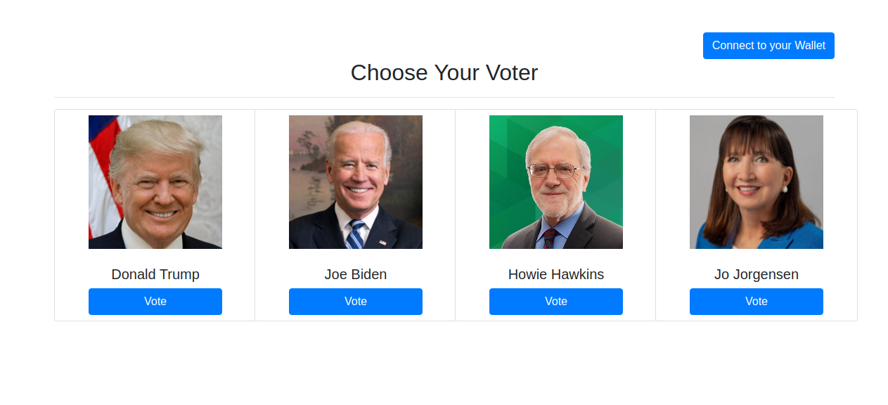
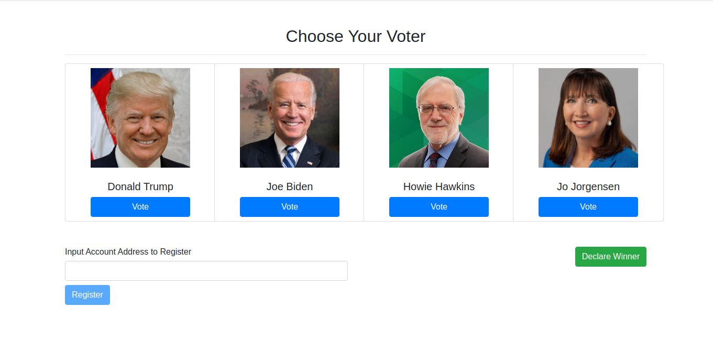
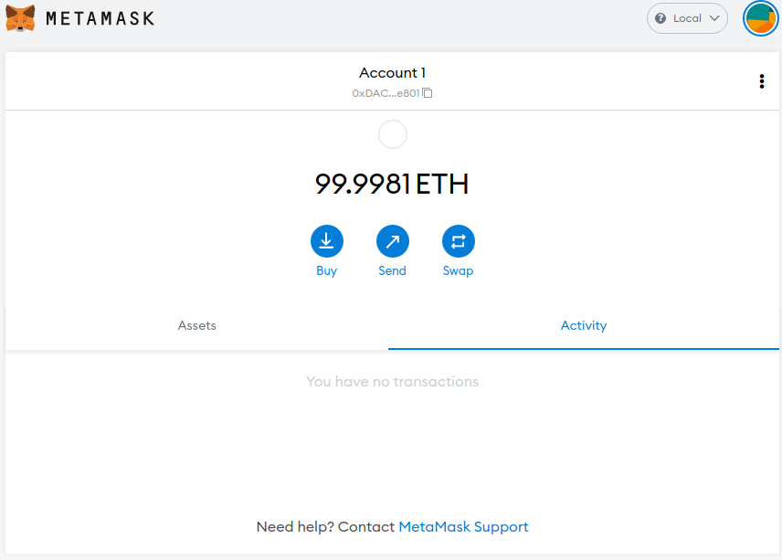
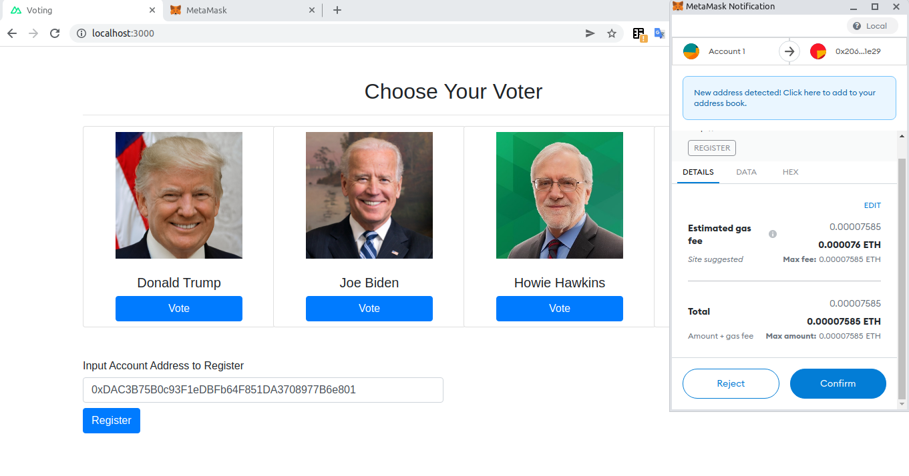
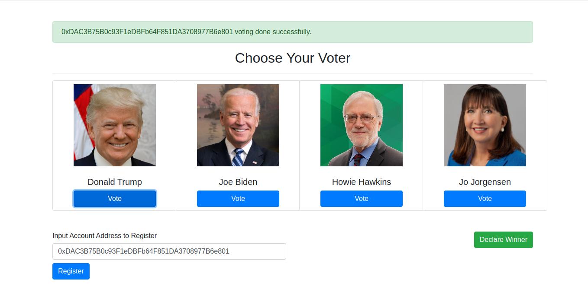
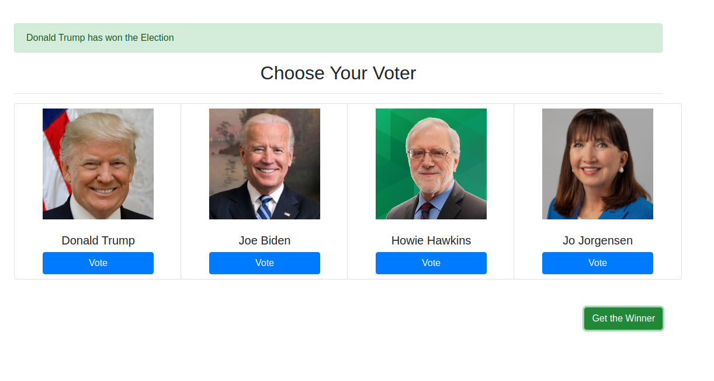

# Blockchain-Decentralized-Voting-DApp-with-Web3-SmartContract

This application refers to Blockchain based Decentralized Voting Application(DApp) with Web3 and Smart Contract Technology. This application is completely done with VueJs(Nuxt)(FrontEnd), SmartContract(Solidity) and Web3. MetaMask is needed to connect the blockchain server.

The owner of the Contract(Beneficiary) deploy the contract. There are 4 candidates in this voting platform. The Beneficiary can register voters with their account addresses. The Beneficiary's vote has the weight 2 and  other voters's votes have weight 1. The Voters can connect to their Wallet to Vote. After Vote they can see who is the winner by pressing the "Get the Winner" Button.

